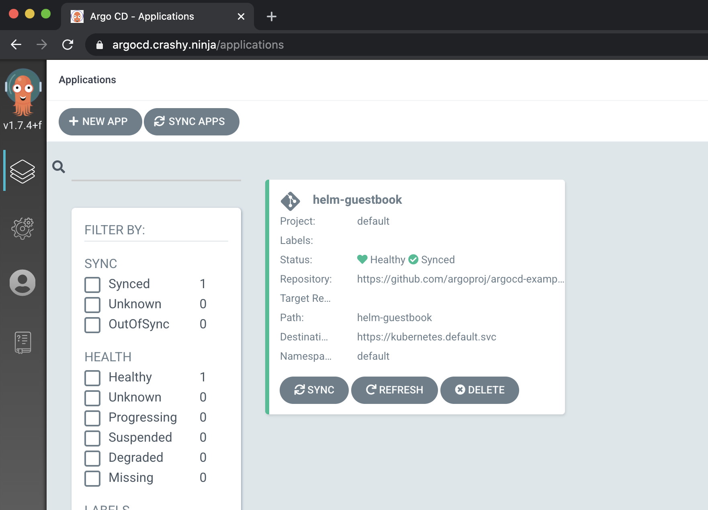
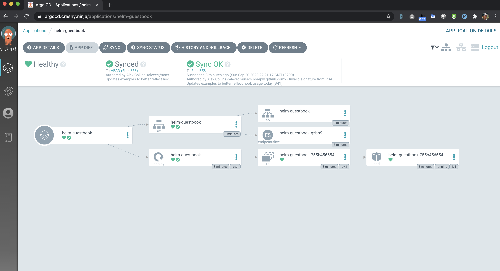

# argocd-using-contour-ingress
This repo contains a step-by-step tutorial to setup Contour as Ingress Controller and to install and configure ArgoCD to exposes its endpoints using Contour. In order to expose the ArgoCD endpoints securly we will install and configure Cert-Manager with LetsEncrypt to be able to automatically provision SSL certificates for exposed services.

I am using my test domain `crashy.ninja` in this tutorial, which is managed by AWS Route 53. At the of this tutorial the Argo UI will be available under `https://argocd.crashy.ninja` and the GRPC endpoint will be available under `https://grpc.crashy.ninja`.

# Prerequisite
* K8S Cluster on Hyperscaler with the ability to use Services of type Loadbalancer
* kubectl configured to access K8S Cluster
* Helm 3 CLI installed 
* ArgoCD CLI installed
* Your own domain for which you can create A- and CNAME records

# Setting up infra
You can use the following command to setup all needed components (Ingress & Certmamanger) and in the end install ArgoCD with the needed configuration to expose its endpoint publically secured by Letsencrypt certificates. 


## Configure Helm repos of the used Helm Charts 
```
helm repo add bitnami https://charts.bitnami.com/bitnami
helm repo add jetstack https://charts.jetstack.io
helm repo add argo https://argoproj.github.io/argo-helm
```

## Install Contour using Helm
```
$ helm install contour bitnami/contour
``` 
Wait until the next command lists an EXTERNAL-IP and copy it / note it down and end `kubectl` pressing STRG/CTRL-C
```
$ kubectl get service contour-envoy -o wide -w
```

## Configure your DOMAIN to point to this IP (e.g. in AWS Route 53)
Log into the DNS service which manages your domain and added a A-Record for `argocd.<YOUR-DOMAIN>` pointing to the EXTERNAL_IP of the `contour-envoy` service and a CNAME for `grpc.argocd.<YOUR-DOMAIN>` which points to `argocd.<YOUR-NAME>`.

## Install Certmanager 
Now we can continue to install Certmanager.
```
$ helm install certmanager jetstack/cert-manager -f certmanagerValues.yaml

NAME: certmanager
LAST DEPLOYED: Sun Sep 20 21:30:48 2020
NAMESPACE: default
STATUS: deployed
REVISION: 1
TEST SUITE: None
NOTES:
cert-manager has been deployed successfully!

In order to begin issuing certificates, you will need to set up a ClusterIssuer
or Issuer resource (for example, by creating a 'letsencrypt-staging' issuer).

More information on the different types of issuers and how to configure them
can be found in our documentation:

https://cert-manager.io/docs/configuration/

For information on how to configure cert-manager to automatically provision
Certificates for Ingress resources, take a look at the `ingress-shim`
documentation:

https://cert-manager.io/docs/usage/ingress/
```

Once Certmanager is installed successfully, you need to replace occurrences of my email adress `andreas@bucksteeg.de` with your email address the following two files: `letsencrypt-prod.yaml` & `letsencrypt-staging.yaml` (under `acme.email`). Now you can install the two ClusterIssuer using the following `kubectl`commands.
```
$ kubectl apply -f letsencrypt-prod.yaml
clusterissuer.cert-manager.io/letsencrypt-prod created

$ kubectl apply -f letsencrypt-staging.yaml
clusterissuer.cert-manager.io/letsencrypt-prod created
```
## Install ArgoCD
Now we have setup all the needed components (Ingress, CertManager with LetsEncrypt configuration) and we are ready to install ArgoCD with configuration settings (which you can find in the `argocdValues.yaml` file) to expose the ArgoCD endpoints publically via Contour Ingress with tls certificates automatically provisioned.
First you need to edit `argocdValues.yaml` and replace all references to my domain `crashy.ninja` with your domain by replacing all occurrences of `crashy.ninja` with `<YOUR-DOMAIN>`. Now we can install ArgoCD using the configuration by running:
```
$ helm install argocd argo/argo-cd -f argocdValues.yaml --namespace argocd

manifest_sorter.go:192: info: skipping unknown hook: "crd-install"
manifest_sorter.go:192: info: skipping unknown hook: "crd-install"
NAME: argocd
LAST DEPLOYED: Sun Sep 20 21:32:29 2020
NAMESPACE: argocd
STATUS: deployed
REVISION: 1
TEST SUITE: None
NOTES:
In order to access the server UI you have the following options:

1. kubectl port-forward service/argocd-server -n argocd 8080:443

    and then open the browser on http://localhost:8080 and accept the certificate

2. enable ingress in the values file `service.ingress.enabled` and either
      - Add the annotation for ssl passthrough: https://github.com/argoproj/argo-cd/blob/master/docs/operator-manual/ingress.md#option-1-ssl-passthrough
      - Add the `--insecure` flag to `server.extraArgs` in the values file and terminate SSL at your ingress: https://github.com/argoproj/argo-cd/blob/master/docs/operator-manual/ingress.md#option-2-multiple-ingress-objects-and-hosts


After reaching the UI the first time you can login with username: admin and the password will be the
name of the server pod. You can get the pod name by running:

kubectl get pods -n argocd -l app.kubernetes.io/name=argocd-server -o name | cut -d'/' -f 2
```
When ArgoCD has been installed successfully, you can check if the certificates are ready and you can test accessing the ArgoCD UI / CLI using https. After some time both certificates sh0uld be ready.
```
$ kubectl get certificates -n argocd -w 

NAME           READY   SECRET         AGE
argocert       True    argocert       44s
argogrpccert   True    argogrpccert   45s
```

By default ArgoCD uses the name of the ArgoCD Server Pod as the password, execute the following command and copy it as you need it to log into the UI or CLI
```
$ kubectl get pods -n argocd | grep argocd-server | awk '{print $1}'
argocd-server-cf675d48c-xs9xg
```
Now you can login into the UI by opening the following URL: https://argocd.<YOUR-DOMAIN> (e.g. in my example https://argocd.crashy.ninja). You should now see the ArgoCD login page and your browser should display that the connection is secured with a valid certificate. Login in by using `admin` as user and the pwd you just copied in the step before. Now you should be logged in successfully and see and empty ArgoCD UI and admittely this is a bit boring. So lets configure an example App and use the CLI to do so:

First lets log into ArgoCD using the CLI
```
$ argocd login grpc.argocd.crashy.ninja --username admin --password "argocd-server-cf675d48c-xs9xg"

'admin' logged in successfully
Context 'grpc.argocd.crashy.ninja' updated
```

Now lets configure an example App from the https://github.com/argoproj/argocd-example-apps repo:
```
argocd app create helm-guestbook --repo https://github.com/argoproj/argocd-example-apps.git --path helm-guestbook --dest-server https://kubernetes.default.svc --auto-prune --sync-policy automated --self-heal --dest-namespace default

application 'helm-guestbook' created
```
If you now switch back to the UI, you see how the Guestbook application gets deployed. 


Click on the helm-guestbook app to see more details:
